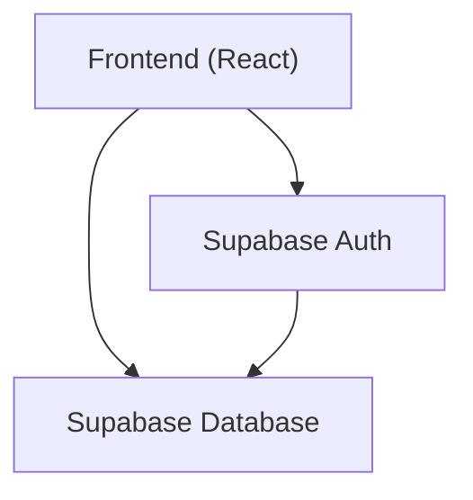
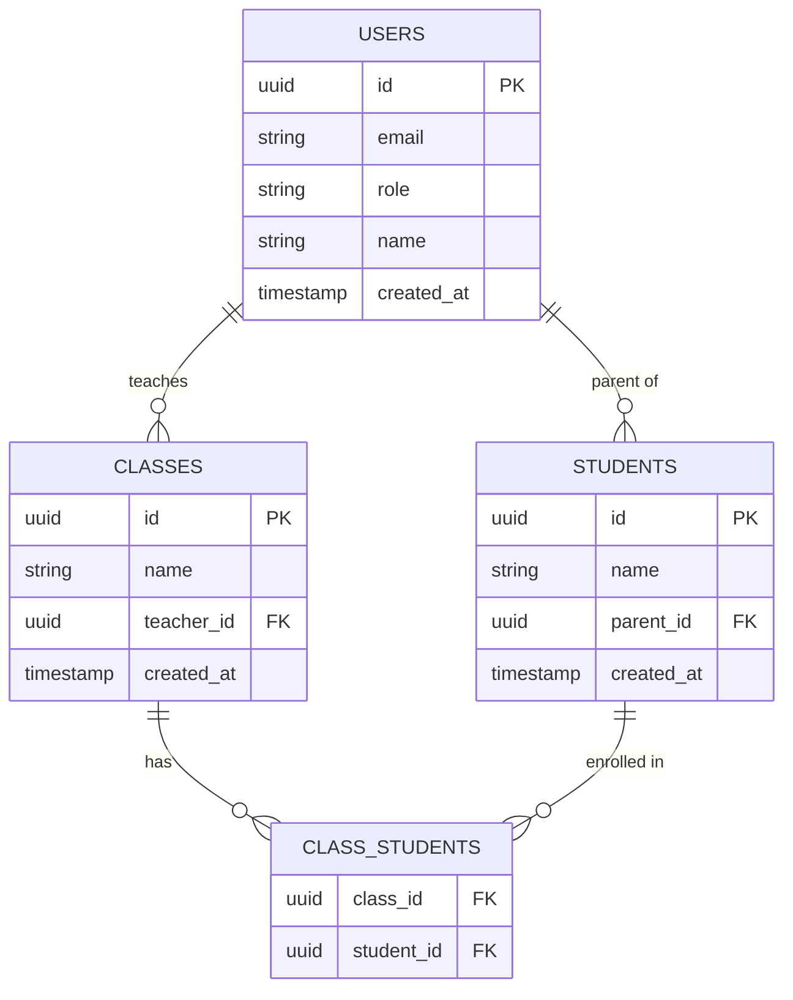

## 1. Architecture Design



## 2. Technology Description
- Frontend: React@18 + TypeScript + Tailwind CSS@3 + Vite
- Initialization Tool: Vite
- Backend: None (use Supabase)
- Database: Supabase PostgreSQL
- Authentication: Supabase Auth

## 3. Route Definitions
| Route | Purpose |
|-------|---------|
| /login | Login page |
| /dashboard | Role-specific dashboard |
| /classes | Classes management |
| /students | Students management |
| /profile | User profile |

## 4. API Definitions (if backend exists)
Not applicable (using Supabase directly)

## 5. Server Architecture Diagram (if backend exists)
Not applicable

## 6. Data Model

### 6.1 Data Model Definition



### 6.2 Data Definition Language
```sql
-- Create roles table
create table public.roles (
  id uuid primary key default gen_random_uuid(),
  name text unique not null
);

-- Create users table
create table public.users (
  id uuid primary key references auth.users(id) on delete cascade,
  email text unique not null,
  role text not null references public.roles(name),
  name text not null,
  created_at timestamp with time zone default timezone('utc'::text, now()) not null
);

-- Create classes table
create table public.classes (
  id uuid primary key default gen_random_uuid(),
  name text not null,
  teacher_id uuid references public.users(id) on delete cascade,
  created_at timestamp with time zone default timezone('utc'::text, now()) not null
);

-- Create students table
create table public.students (
  id uuid primary key default gen_random_uuid(),
  name text not null,
  parent_id uuid references public.users(id) on delete set null,
  user_id uuid references public.users(id) on delete set null,
  created_at timestamp with time zone default timezone('utc'::text, now()) not null
);

-- Create class_students join table
create table public.class_students (
  class_id uuid references public.classes(id) on delete cascade,
  student_id uuid references public.students(id) on delete cascade,
  primary key (class_id, student_id)
);

-- Enable Row Level Security (RLS)
alter table public.users enable row level security;
alter table public.classes enable row level security;
alter table public.students enable row level security;
alter table public.class_students enable row level security;

-- Insert initial roles
insert into public.roles (name) values ('Admin'), ('Teacher'), ('Student'), ('Parent');
```
