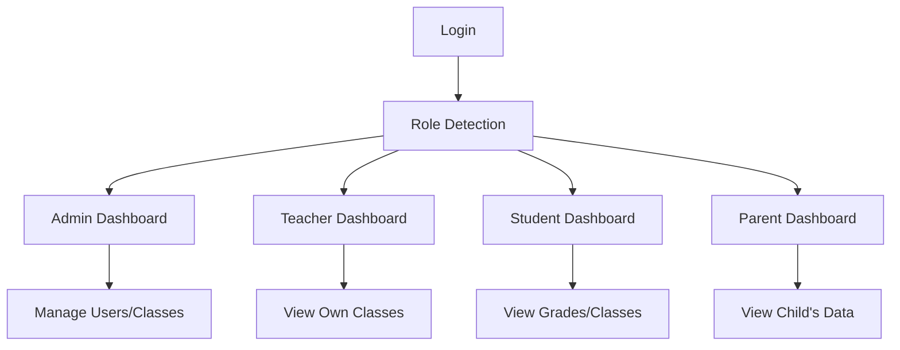

## 1. Product Overview
A comprehensive school management system with distinct user roles (Admin, Teacher, Student, Parent) built with React frontend and Supabase for authentication and database. The system enables efficient management of classes, students, and school operations with role-based access control.

## 2. Core Features

### 2.1 User Roles
| Role | Registration Method | Core Permissions |
|------|---------------------|------------------|
| Admin | Email registration | Manage all users, classes, and school settings |
| Teacher | Email registration | Manage own classes and view assigned students |
| Student | Email registration | View own classes and grades |
| Parent | Email registration | View child's classes and grades |

### 2.2 Feature Module
1. **Login page**: User authentication with role selection
2. **Dashboard**: Role-specific dashboard with overview
3. **Classes management**: Admin/Teacher manage classes
4. **Students management**: Admin manage all students; Teacher view own class students
5. **Profile page**: User profile management

### 2.3 Page Details
| Page Name | Module Name | Feature description |
|-----------|-------------|---------------------|
| Login | Authentication | Login with email/password, role-based redirection |
| Dashboard | Overview | Role-specific cards, quick actions, statistics |
| Classes | Classes Management | Admin: Create/Edit/Delete classes; Teacher: View own classes only |
| Students | Students Management | Admin: Manage all students; Teacher/Parent/Student: View relevant students |
| Profile | Profile Management | Edit user information |

## 3. Core Process
User logs in → Role detected → Redirect to role-specific dashboard → Access allowed modules based on permissions

## 4. User Interface Design
### 4.1 Design Style
- Primary color: #2563eb (blue)
- Secondary colors: #1e40af, #dbeafe
- Button style: Rounded, smooth transitions
- Fonts: Poppins for display, Inter for body
- Layout style: Card-based with sidebar navigation
- Icons: Lucide React icons

### 4.2 Page Design Overview
| Page Name | Module Name | UI Elements |
|-----------|-------------|-------------|
| Login | Auth form | Centered form, smooth animations, clean design |
| Dashboard | Overview cards | Grid layout, subtle shadows, gradient backgrounds |
| Classes | Classes list | Table view, action buttons, responsive design |
| Students | Students list | Filterable table, role-based visibility |

### 4.3 Responsiveness
Desktop-first, mobile-adaptive with touch optimization

### 4.4 3D Scene Guidance
Not applicable for this project.
